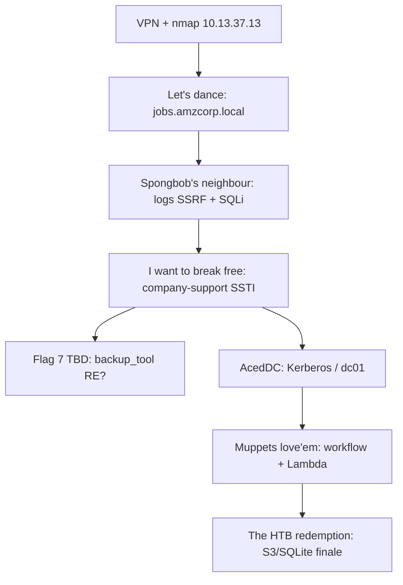

# HTB AWS Fortress — Live Recon & Capture Plan

Target: **AWS Fortress** (Fortress #5, Amazon Web Services) — `amzcorp.local` AD + multi-subdomain web/cloud chain.

| Item | Value |
|---|---|
| **Fortress IP** | `10.13.37.13` |
| **Domain** | `amzcorp.local` |
| **VPN** | `us-fort-1` → `config/fortresses_us-fort-1.ovpn` |
| **Flag count** | **7 flags** (HTB UI, 2026) — older public writeups describe **10** music-titled sections; treat those as technique reference only |

> **Multi-agent:** Do not kill or reconnect OpenVPN without checking `MULTI_AGENT_WORKFLOW.md` and `notes/progress.log`. Only one agent should run live attacks at a time.

---

## VPN — coordinate before connecting (requires sudo)

If no other agent is on fortress VPN, connect with:

```bash
bash /home/gablegoob/Desktop/Skool/keylogtest/aws_pentest/scripts/vpn_connect.sh
```

Or foreground (user terminal):

```bash
sudo openvpn --config "/home/gablegoob/Desktop/Skool/keylogtest/aws_pentest/config/fortresses_us-fort-1.ovpn" --disable-dco
```

Verify:

```bash
ip -4 addr show tun0
ping -c2 10.13.37.13
curl -sI --max-time 5 http://10.13.37.13/
```

---

## /etc/hosts (sudo) — add as subdomains are discovered

```bash
sudo tee -a /etc/hosts <<'EOF'
10.13.37.13 amzcorp.local jobs.amzcorp.local
EOF
```

Known subdomains (confirm with vhost fuzz / status route):

- `jobs.amzcorp.local` — Flask jobs portal (web foothold)
- `logs.amzcorp.local` — log viewer (SSRF pivot)
- `jobs-development.amzcorp.local` — exposed `.git`
- `company-support.amzcorp.local` — support portal (JWT / SSTI → RCE)
- `workflow.amzcorp.local` — workflow admin (AWS cred export)
- `cloud.amzcorp.local` — LocalStack-style AWS API endpoint
- `inventory.amzcorp.local` — inventory service (forum mentions)
- `dc01.amzcorp.local` — domain controller
- Additional `*.amzcorp.local` on internal Docker network

Full list: `artifacts/subdomains_known.txt`

---

## HTB UI flag map (7 flags — names only, no spoilers)

Public writeups used different internal section titles (Early Access, Inspector, …). HTB UI now shows pop-culture names. Mapping below is **best-guess** from legacy technique order; confirm against live UI as flags are captured.

| # | HTB UI name | Likely phase | Technique category | Legacy writeup section |
|---|-------------|--------------|-------------------|------------------------|
| 1 | **AcedDC** | AD / DC | Kerberos user enum, ASREPRoast, SMB on `dc01`, domain creds | Long Run (+ Shortcut) |
| 2 | **Let's dance** | Web foothold | Register on jobs portal, deobfuscate JS, admin API token IDOR | Early Access |
| 3 | **Spongbob's neighbour** | Web pivot | SSRF via `/api/v4/status` → `logs.amzcorp.local`, log/git mining, SQLi | Inspector + Statement |
| 4 | **I want to break free** | Web breakout | `company-support` account confirm, ECDSA JWT forgery, SSTI → shell | Relentless |
| 5 | **Muppets love'em** | Cloud / Lambda | `workflow.amzcorp.local` variable export → AWS CLI against `cloud.amzcorp.local`, Lambda RCE | Jerry-built |
| 6 | **The HTB redemption** | Final privesc | S3 database dumps, SQLite cred recovery, domain/cloud finale | Demolish |
| 7 | *(unknown)* | TBD | **Candidate A:** SUID `backup_tool` reversing (Ghidra/ltrace). **Candidate B:** DynamoDB scan + SQS long-poll abuse | Magnified / Line Up / Inventory |

Track capture status in `FLAG_TRACKER.md`.

---

## Attack chain overview (7-flag model)



Cloud mid-chain (DynamoDB creds from firmware share, SQS polling) may belong to flag 7 or span flags 5–7 depending on HTB's consolidation.

---

## Tools needed

- `nmap`, `ffuf`/`gobuster`, `curl`, `python3`, `requests`
- `aws-cli` v2, `crackmapexec`/`netexec`, `impacket`
- `ghidra`/`radare2`/`ltrace` for `backup_tool` binary
- `kerbrute`, `bloodhound` (optional)
- `git-dumper`, `john`, `hashcat`

---

## Difficulty assessment

**Overall: Hardest HTB fortress / multi-day solo.** Breadth — web + AD + LocalStack-style AWS + reversing:

1. **Web chain** (flags 2–4): Flask IDOR, SSRF, SQLi, SSTI — manageable in a day with OWASP experience.
2. **AD segment** (flag 1): Kerberos, LDAP, SMB, WinRM — solid Windows/AD chops required.
3. **Cloud segment** (flags 5–7): Real AWS API work (Lambda, DynamoDB, SQS, S3, IAM) on `cloud.amzcorp.local`.
4. **Binary reversing** (likely flag 7): SUID implant needs Ghidra/strings/ltrace comfort.
5. **Internal Docker network**: multiple containers; `/etc/hosts` hygiene matters.

Expect **3–7 days** solo, **1–2 days** with a coordinated team and AWS experience.

---

## Session artifacts

- `artifacts/nmap_*.txt` — port scans
- `artifacts/subdomains_known.txt` — vhost discovery
- `artifacts/attacker_ip.txt` — VPN IP after connect
- `notes/progress.log` — timestamped findings
- `FLAG_TRACKER.md` — 7-flag status
- `MULTI_AGENT_WORKFLOW.md` — agent handoff rules
